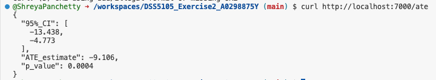

# DSS5105 Exercise 2 – A0298875Y

## Overview
This project applies the Rubin Causal Model to estimate the Average Treatment Effect (ATE) using simulated corporate engagement data. The trained model is deployed via a Flask API and containerized with Docker for reproducibility.

## Project Components

### `app.py`
- A Flask API that serves:
  - `/predict`: Predicts stakeholder engagement score based on treatment (W) and spending (X).
  - `/ate`: Returns the estimated ATE, p-value, and confidence interval from statsmodels.

### `requirements.txt`
Lists dependencies: Flask, NumPy, pandas, scikit-learn, statsmodels.

### `Dockerfile`
Defines a lightweight Python environment with all packages pre-installed. Enables seamless deployment in Codespaces or locally.


##  Docker Instructions

### Build the Image
```docker build -t my-api .```

### Run the Container
```docker run -p 7000:7000 my-api```

### Question 1(b):
## ATE Endpoint
```curl http://localhost:7000/ate```
Response:
"ATE_estimate": -9.106,
"p_value": 0.0004,
"95%_CI": [-13.438, -4.773]




## Regression Summary Output
Terminal Output when Flask Starts:


Docker Container Output:


Q1.2 – ATE Estimate and Significance

• Estimated α (intercept): 95.9662  
• Estimated τ (treatment effect / ATE): −9.1057  
• Estimated β (effect of spending): 1.5149  
• P-value for τ: 0.000  
• 95% Confidence Interval for τ: [−13.438, −4.773]

Interpretation: The analysis indicates that, on average, corporations that participated in the carbon offset program experienced a 9.11-point lower stakeholder engagement score compared to those that did not, after accounting for differences in sustainability spending. This estimated treatment effect (ATE) is statistically significant, suggesting that the observed reduction is unlikely due to random chance and may reflect a real, negative causal impact of program participation on stakeholder perceptions.


 Q1.3 – Assumptions for Causal Interpretation of τ̂

1. SUTVA (Stable Unit Treatment Value Assumption): The engagement score of each corporation is dependent solely on its own participation status. One corporation's treatment does not influence the results of another.
2. Unconfoundedness: The decision to participate in the carbon offset program and stakeholder engagement are not influenced by any hidden variables after accounting for sustainability expenditures. This implies that the observed relationship is not influenced by other unmeasured factors.
3. Overlap: Each corporation had a positive probability of either being in the treatment group (participating) or the control group (not participating). There was no restriction on the treatment status of any corporation.

### Prediction Endpoint

curl "http://localhost:7000/predict?W=1&X=20"

Question 2c:
Response:
"W": 1.0,
"X": 20.0,
"predicted_Yobs": 117.16


